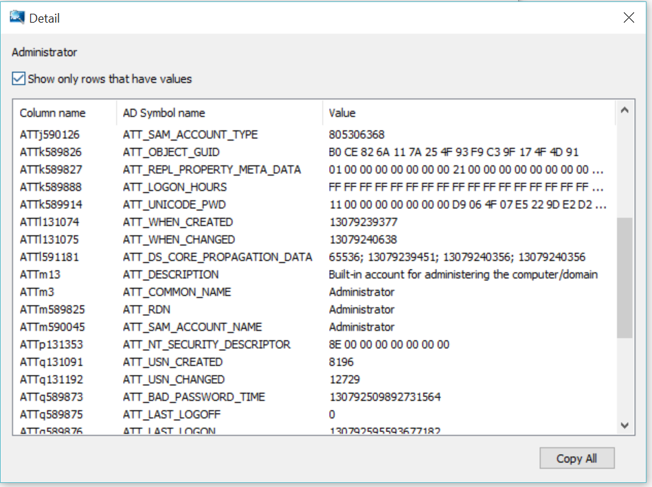
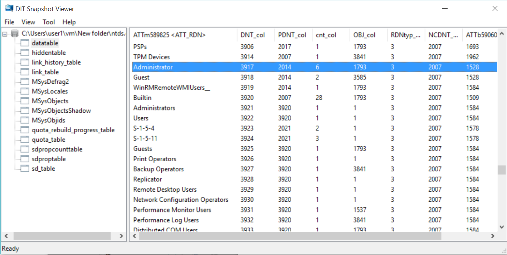

#DIT Snapshot Viewer
DIT Snapshot Viewer is an inspection tool for Active Directory database, ntds.dit. This tool connects to ESE(Extensible Storage Engine) and reads tables/records including hidden objects by [low level C API](https://msdn.microsoft.com/en-us/library/gg269259%28v=exchg.10%29.aspx).

The tool can extract ntds.dit file without stopping lsass.exe. When Active Directory Service is running, lsass.exe locks the file and does not allow to access to it. The snapshot wizard copies ntds.dit using VSS(Volume Shadow Copy Service) even if the file is exclusively locked. As copying ntds.dit may cause data inconsistency in ESE DB, the wizard automatically runs __esentutil /repair__ command to fix the inconsistency.

EseDataAccess static library can be used for other ESE inspection applications. It has C++ object-oriented representation of ESE C API. For example, ESE table is represented by EseTable class defined as below.
```C++
class EseTable
{
	public:
		EseTable(const EseDatabase* const eseDatabase, const string& tableName);
		~EseTable();
		void Init();
		void MoveFirstRecord();
		BOOL MoveNextRecord();
		void Move(uint rowIndex);
		int CountColumnValue(uint columnIndex) const;
		wstring RetrieveColumnDataAsString(uint columnIndex, uint itagSequence = 1);
		uint GetColumnCount() const;
		wstring GetColumnName(uint columnIndex) const;
}
```
Prebuild executable is available here.
[Download ditsnap.exe](https://github.com/yosqueoy/ditsnap/blob/master/x64/Release/ditsnap.exe?raw=true)

##Main Window

##Detail Dialog


##Build Environment
Visual C++ 2013
